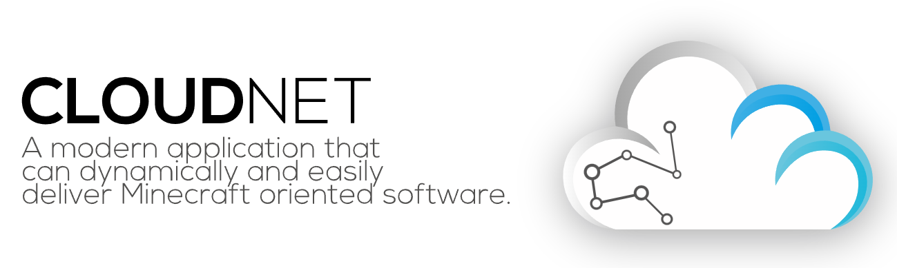

# CloudNet: The Cloud Network Environment Technology




## Adding CloudNet to your build

CloudNet is using the `eu.cloudnetservice.cloudnet` group id and is available through maven central. The most important
submodules are:

| artifact id | usage                                                                                                        |
|-------------|--------------------------------------------------------------------------------------------------------------|
| driver      | When developing plugins or modules, available on all platforms.                                              |
| node        | When developing a module which needs more specific access to node functions than the driver can offer.       |
| wrapper-jvm | When developing plugins which need some more specific access to the service api than the driver can offer.   |
| bridge      | When trying to catch player events and/or interacting with players regardless where they are on the network. |
| bom         | When you want to import all dependencies with the same version based on the imported bill of materials.      |

To add the CloudNet dependency using gradle (replace `%version%` with the latest version shown in the badge above):

```groovy
repositories {
  // ensure maven central is added
  mavenCentral()
}

dependencies {
  // optional - you can also specify versions directly
  implementation platform('eu.cloudnetservice.cloudnet:bom:%version%')
  compileOnly 'eu.cloudnetservice.cloudnet:driver'

  // without bom
  compileOnly 'eu.cloudnetservice.cloudnet:driver:%version%'
}
```

To add the CloudNet dependency using maven (replace `%version%` with the latest version shown in the badge above):

```xml
<!-- optional - you can also specify versions directly -->
<dependencyManagement>
  <dependencies>
    <dependency>
      <groupId>eu.cloudnetservice.cloudnet</groupId>
      <artifactId>bom</artifactId>
      <version>%version%</version>
      <type>pom</type>
      <scope>import</scope>
    </dependency>
  </dependencies>
</dependencyManagement>

<dependencies>
  <dependency>
    <groupId>eu.cloudnetservice.cloudnet</groupId>
    <artifactId>driver</artifactId>
    <version>%version%</version> <!-- only needed when bom is not used -->
    <scope>provided</scope>
  </dependency>
</dependencies>
```

## Snapshots

Snapshots for CloudNet are build off the `nightly` branch and are available from the sonatype snapshot repository:
`https://s01.oss.sonatype.org/content/repositories/snapshots/`. You can declare a dependency on CloudNet as shown above
just append the `-SNAPSHOT` suffix to the version.

## Links

- [GitHub Repo](https://github.com/CloudNetService/CloudNet-v3)
- [Issue Tracker](https://github.com/CloudNetService/CloudNet-v3/issues/new)
- [Support Discord](https://discord.cloudnetservice.eu)
- [General Discussion](https://github.com/CloudNetService/CloudNet-v3/discussions)
- [Latest Release](https://github.com/CloudNetService/CloudNet-v3/releases/latest)
- [SpigotMC](https://www.spigotmc.org/resources/42059)

## Compile from source

To compile CloudNet you need JDK 22 and an internet connection. Then clone this repository and run `./gradlew` inside
the cloned project.

## Warnings

1. Api methods which are marked with `@ApiStatus.Internal` can change or get removed without a warning, even between
   patch releases. We recommend to not use these methods and try to find an alternative for them.
2. Api methods which are marked with `@ApiStatus.Experimental` can change or get removed without a warning, even between
   patch releases. While the api method is still in an experimental state, that does not mean that the implementation is
   considered experimental.
3. Api methods which are marked with `@Deprecated` should get replaced as soon as possible (the javadoc of the method
   will contain and explanation why the method is deprecated and how to replace the usage). This annotation is in most
   cases paired with `@ApiStatus.ScheduledForRemoval` indicating the minor version when the method gets removed.
4. Serialized forms of all classes are subject to change. Do not persist classes and assume that a future version will
   still be compatible with the stored version.
5. Dependencies which are not exposed directly might be upgraded to the next major release without a warning. Be aware
   of that when including dependencies and relying on CloudNet shipping them bundled.
